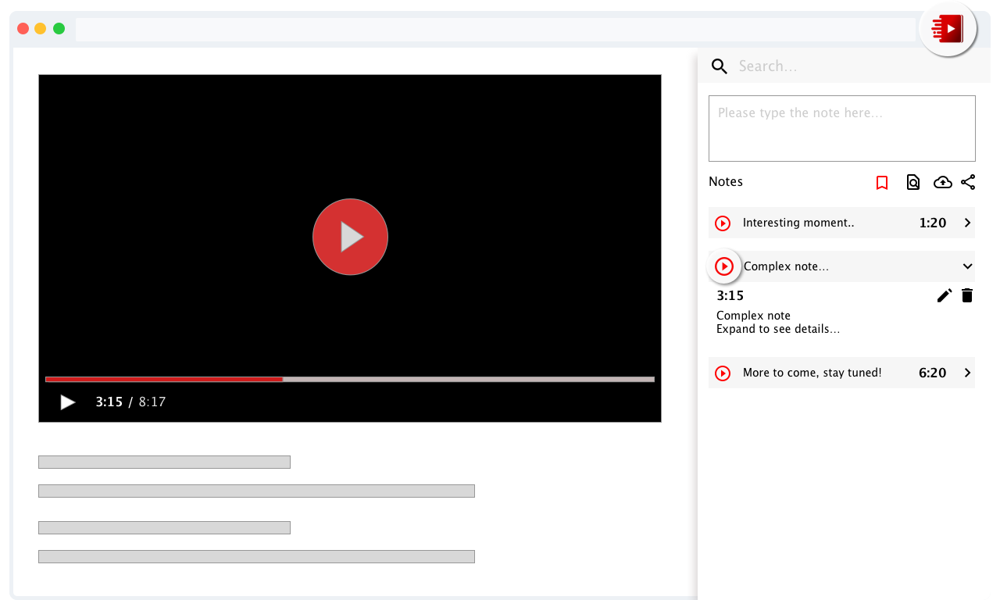

# YiNote Browser Extension

YiNote, aka TurboNote Chrome Extension, is an effective tool to take and share notes while watching online videos.



## Installation

<a href="https://chrome.google.com/webstore/detail/yinote/fhpgggnmdlmekfdpkdgeiccfkignhkdf"></a>
<a href="https://addons.mozilla.org/en-CA/firefox/addon/yinote/"></a>
<a href="https://microsoftedge.microsoft.com/addons/detail/gieehphfgjfjmeejdohpdiajmicjnfbh"></a>

## Table of Contents

- [Introduction](#introduction)
  - [Purpose and history](#purpose-and-history)
  - [Features](#features)
- [Get started](#get-started)
  - [How to use](#how-to-use)
  - [Development](#development)
    - [Prerequisite](#prerequisite)
    - [Install dependencies](#install-dependencies)
    - [Start development](#start-development)
- [About the project](#about-the-project)
  - [Project components](#project-components)
  - [Tech stack](#tech-stack)
  - [Browser support](#browser-support)
- [Contribute](#contribute)
  - [As a community](#as-a-community)
  - [As a developer](#as-a-developer)
  - [Translate YiNote](#translate-yinote)
- [Support YiNote in your website](#support-yinote-in-your-website)
- [Roadmap](#roadmap)
- [FAQs](#faqs)
- [License](#license)

## Introduction

### Purpose and history

YiNote, aka TurboNote chrome extension, is developed to help online learner and video editor to bookmark thoughts and ideas in a fine-grained way while working or learning with online materials. It was developed in 2016 as a side project, and luckily loved by thousands users all around the world.

During the COVID-19 pandemic, I rewrote the extension in a more scalable and maintainable approach. Hopefully it can fill the needs from different users, and boost your learning experience to next level.

### Features

- Take time-stamped note while watching online video, currently supported video formats/platform:
  - Youtube video
  - Embedded youtube iframe video
  - HTML5 video
  - Local video via browser
- Send notes to popular note platforms
  - Google Docs
  - MS OneNote
  - Evernote
- Support markdown styling in editor
- Generate PDF with video screenshot
- Annotate screenshot
- Bookmark video
- Tag bookmarks
- Search through bookmarks and notes
- Export and import of data

### Get started

#### How to use

There are serveral options to use this extension:

- Install extension from web stores

  Please see [Installation section](#installation) to install extension from official platform stores. If you are user before v1.0.0, please checkout [Migrations Guide](/MIGRATING.md) for more information.

- Build and install extension locally
  
  You can also build the extension, then run it locally. Please see [Development](#development) for more information.

#### Development

##### Prerequisite

Suggested environment:

- Node >= 10.0.0
- NPM >= 6.0.0

##### Install dependencies

For NPM v6 or above:

```bash
npm ci
```

For NPM before v6

```bash
npm install
```

##### Start development

YiNote leverages [Lerna](https://github.com/lerna/lerna) to manage the monorepo.

Please run `npm run bootstrap` to setup dependecies for each sub_modules before start.

Then run `npm start` will start both `extension` and `playground` in development mode.

For `content script` change, you need to reload the extension in `chrome://extensions` tab.

For `background` and `options` changes, just refresh the page should be able to load the changes.

`playground` mode is also provided to easy `content script` development. This mode simulates `content script` to inject UI widget in page served from `webpack dev server`

For more information about how to develop browser extensions, please refer to [Chrome extension get started](https://developer.chrome.com/extensions/getstarted)

## About the project

### Project components

This extension inject [content script](https://developer.chrome.com/extensions/content_scripts) to display UI widget and interact with host page.

[Background Scripts](https://developer.chrome.com/extensions/background_pages) is used for message handling and handling data migrations.

[Options page](https://developer.chrome.com/extensions/options) is provided to give more webpage real estate for data management and configuring settings.

YiNote store data in `browser.storage` on user's local device.

### Tech stack

Thanks for the open source community. YiNote depends on lots of awesome open source modules. In the following part, I'll only list part of them to share base knowledge of the how this project is built.

- [React](https://reactjs.org/) for UI components
- [React Router](https://reacttraining.com/react-router/web/guides/philosophy) for routing. `MemoryRouter` is used for `content script`, `HashRouter` is used for `options` page
- [Easy Peasy](https://easy-peasy.now.sh/) for state management
- [react-i18next](https://react.i18next.com/) for internationalization
- [Styled Components](https://styled-components.com/) to write `cssinjs` styled styles
- [Material UI](https://material-ui.com/) for quickly wrapup complex UI components
- [Webpack](https://webpack.js.org/) as bundler

### Browser support

YiNote leverages mozilla's [Web extension polyfill](https://github.com/mozilla/webextension-polyfill) to achieve better support for Chrome, Firefox and other Chrome-compatible browsers. For detailed support informarion, please see [Supported Browsers](https://github.com/mozilla/webextension-polyfill#supported-browsers)

## Contribute

### As a community

- Expose YiNote to more people, share it via blog post, facebook, twitter etc.
- Answer questions in [the issue tracker](https://www.github.com/shuowu/yi-note/issues)
- Support financially on [Patreon](https://www.patreon.com/yinote) and [GitHub Sponsor](https://github.com/sponsors/shuowu)

### As a developer

Please read the [Contribution Guide](/CONTRIBUTING.md)

### Translate YiNote

YiNote only supports English currently, please help translate YiNote to make it accessible to more users. To translate please follow the [English message json file](https://github.com/shuowu/yi-note/blob/master/extension/_locales/en/messages.json) and translate the content in `message` field into other languages. For detailed information, please follow this [Browser extension i18n doc](https://developer.mozilla.org/en-US/docs/Mozilla/Add-ons/WebExtensions/Internationalization)

All kinds of contributions from anyone are always welcomed!

## Support YiNote in your website

If you have a video website and want to make it work with YiNote, but unfortunately YiNote is not able to properly detect video on your website. There are serveral options you can try.

- Add a new Player to YiNote by following this [pull request](https://github.com/shuowu/yi-note/pull/31)

- Add player hook in your website.
  
  1. Add data attribute, `[data-yinote="yinote-hook-player"]`, to your video element. So YiNote can properly locate your video element.
  2. Add message listener to watch on video action messages from YiNote.
  
  ```js
  window.addEventListener('message', event => {
    const { data } = event;
    if (data.from !== 'yi-note') {
      return;
    }

    switch (data.action) {
      case 'play':
        // handle play video
        return;
      case 'pause':
        // handle pause video
        return;
      case 'seek':
        // get secondsToSeek from data.data
        // then seek to certain time with your player
        return;
      case 'getCurrentTime':
        // get current time from your player, then
        window.postMessage({ ...data, data: $currentTime }, *);
        return;
      case 'getDuration':
        // get duration from your player, then
        window.postMessage({ ...data, data: $duration }, *);
        return;
    }
  }, false);
  ```

## Roadmap

- (Done) Integration with popular note / document platforms, like Evernote, onenote, google doc.

- (Done) Sync notes from mooc platforms

- Web article annotation

- Cloud support

- Fine grained note sharing

- Multiple devices support (Desktop browser, mobile devices)

## FAQs

### How to share notes with others?

- YiNote can send notes to Evernote, MS OneNote, Google Docs since v1.2.0. You can firstly send notes to one of the supported services, then generate share link from there.
- You can also export notes as JSON file in options page, then send the exported JSON file out. Whoever get the exported file can then import it via options page.
  
### What should I prepare if I decide not to use YiNote extension any more?

YiNote save users data in chrome local storage (per extension), which means delete the extension will also erase saved notes from your browser. YiNote provides a backup strategy in options page to export local data into a json file. Please make sure you backup your data before delete the extension. Cloud support will be provided in the future to achieve better sync and backup.

### Why I bookmarked same title and thumbnail for different videos on Youtube?

Youtube don't update page metas, like title and thumbnails, when video changed in page. So reload page is needed to make sure YiNote can capture proper metadata for the video. YiNote also enabled settings in options page to enable auto reload when video change. Page domain, like `www.youtube.com`, need to be added when enable this setting. YiNote only applys reload behaviour to listed domains in the settings page.

## License

Copyright (c) 2016 - 2020

Licensed under the GNU GPL3.0 License. [View license](/LICENSE)
